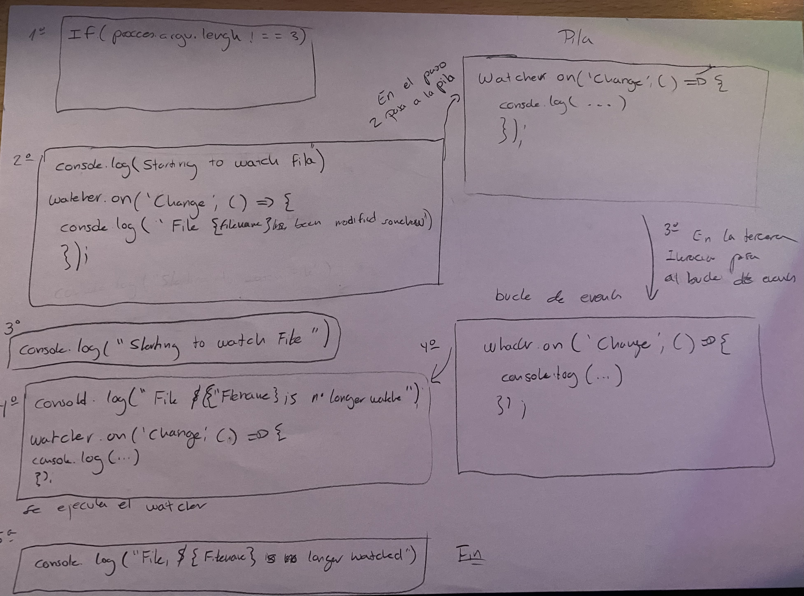

# Practica 10 - Sistemas de ficheros y creación de procesos Node.js

## Datos generales
- Alumno: Jacob Santana Rodríguez
- e-mail: alu010130426@ull.edu.es
- Universidad de la Laguan
- Grado en ingeniería informática
- Curso nº 3, segundo cuatrimestre
- Asignatura: Desarrollo en Sistemas informáticos
- Fecha de entrega: 25/04/2022

## Índice
- [Resumen](#resumen)
- [Ejercicio1]
- [Ejercicio2](#ej2)
- [Ejericicio3](#ej3)
- [Ejercicio4](#ej4)
### Resumen<a name = "resumen"></a>

En esta práctica se plantan una serie de ejercicios a resolver haciendo uso de las APIs proporcionadas por Node.js para interactuar con el sistema de ficheros, así como para crear procesos  

### Ejercicio 1<a name = "ej1"></a>  

### Ejercicio 2<a name = "ej2"></a>

Implementar un programa que devuelva el número de ocurrencias de una palabra en un fichero de texto. Para acceder al contenido del fichero deberá expandir el comando cat, además de expandir el comando grep con la salida proporcionada por cat como entrada para obtener las lineas en las que se encuentra la palabra buscada.

El fichero como la palabra buscada tienen que ser parámetros pasados desde la línea de comandos.

El ejercicio hay que llevarlo a cabo de dos maneras diferentes. Para ello cree un método para cada manera.

La primera forma, haciendo uso del metodo pipe de un stream para poder redirigir la salida de un comando hacia otro.
```typescript
public forma1() {
  if (process.argv.length !== 4) {
    console.log(chalk.red('Por favor ponga un archivo y la palabra a buscar.'));
  } else {
    access(process.argv[2], (err) => {
      if (err) {
        console.log(chalk.red('El archivo no existe.'));
      } else {
        const cat = spawn('cat', [process.argv[2]]);
        const grep = spawn('grep', [process.argv[3]]);
        cat.stdout.pipe(grep.stdin);
        let out = '';
        grep.stdout.on('data', (piece) => out += piece);
        grep.on('close', () => {
          console.log(chalk.blue(out));
          const cont = new RegExp(process.argv[3], 'g');
          if (out.match(cont) != undefined) {
            console.log(chalk.green("La palabra " + process.argv[3] + " aparece " + out.match(cont)?.length + " veces."));
          } else {
            console.log(chalk.red("La palabra " + process.argv[3] + " no aparece en el archivo."));
          }
        });
      }
    });
  }
}
```
Para la resolucion, lo que hice fue:
  - Lo primero un condicional que me asegure que por la linea de comandos se le pasan el archivo y la palabra a buscar, si
  esto no se diese, muestro por pantalla un mensaje de que tiene que poner un el archivo y la palabra a buscar.
  - Luego con la función access verifico si el archivo no existe, gracias a un manejador err. Si err es falso muestro por
  pantalla un mensaje de que el archivo no existe.
  - Una vez verificado la existencia del archivo, gracias a la función spawn creo un objeto childProcess en este caso, cat
  que muestra el contenido de un fichero. Con el comando grep hago lo mismo gracias a la función spawn.
  - Ahora, accedemos al proceso hijo stdout y le pasamos la entrada del pipe.
  - Creo la variable out que la voy a usar para ir concatenando los valores.
  - Con el método on, voy a concatenar los valores leidos desde el stream a través del buffer,
  - Con el evento close, muestro por consol todos los valores obtenidos. Como en el enunciado nos pide crear una expresión
  regular para mostrar cuantas veces aparece la palabra buscada. Por ello cree la variable cont. Con la ayuda del método
  match logro contar cuántas palabras hay. Si el valor no es undefined muestro cuantas veces aparece la palabra, pero si 
  es undefined quiere decir que la palabra no aparace y lo muestro por pantalla. 

Cuando muestro los mensajes, los fallos, los muestro en rojo y los aciertos de color verde haciendo uso del paquete chalk  
  

### Ejercicio 3<a name = "ej3."></a>

En este ejercicio se nos pide que a partir de la practica 9, desarrollar un ejercicio que cada vez que se produzca un cambio en el directorio, el programa debe indicar si se ha añadido, borrado o modificado una nota. Para lograrlo añadi al directorio de la practica, los archivos para hacer el yargs de la practica 9. Ademas hay que hacer uso de la funcion watch

Para la resolucion de el ejercicio cree una clase, la cual le paso un usuario, por la línea de comandos. Dicha clase tiene su correspondiente getter y setter del atributo usuario y el metodo management, donde aplico la solucion al ejercicio. Hago uso del callback para poder llevar acabo las pruebas.

```typescrpt
export class Ejercicio3 {
  constructor(private user: string) {}
  /**
   * Metodo que devuelve el usuario pasado por parametro
   * @returns {this.user} usuario
   */
  public getUser(): string {
    return this.user;
  }

  /**
   * Método que cambia el valor del usuario por el pasado por parametro
   * @param user Nuevo usuario pasado a asignar
   */
  public setUser(user: string): void {
    this.user = user;
  }
  /**
   * Metodo que verifica si se ha creado borrado o editado una nota
   * @param callback callback que se le pasa por parametro
   */
  public management(callback: (err: string | undefined, data: string | undefined) => void): void {
    fs.access(`./${this.user}`, fs.constants.F_OK, (err) => {
      if (err) {
        callback(chalk.red("El archivo no existe " + err.message), undefined);
      } else {
        fs.watch(`./${this.user}`, (eventType, filename) => {
          if (eventType === 'rename') {
            fs.access(`./${this.user}/${filename}`, fs.constants.F_OK, (err) => {
              if (err) {
                callback(chalk.green("El archivo fue borrado " + err.message), undefined);
              } else {
                fs.readFile(`./${this.user}/${filename}`, (err, data) => {
                  if (err) {
                    callback(chalk.red("El archivo no pudo ser leido " + err.message), undefined);
                  } else {
                    callback(undefined, chalk.green("El archivo fue creado satisfactoriamente " + data.toString()));
                  }
                });
              }
            });
          } else {
            fs.readFile(`./${this.user}/${filename}`, (err, data) => {
              if (err) {
                callback(chalk.red("El archivo no pudo ser leido " + err.message), undefined);
              } else {
                callback(undefined, chalk.green("El archivo fue modificado con exito " + data.toString()));
              }
            });
          }
        });
      }
    });
  }
}
```  

El metodo `management`.  
A este metodo le paso por parametro el callback. Lo primero que hago es, comprobar que el archivo existe, a traves de la funcion acess. Compruebo a traves del callback err, que si da falla quiere decir que el archivo no existe, por lo tanto hago un callback que devuelva el mensaje que el archivo no existe, y muestre el error del callback. Cabe destacar que en cada mensaje que imprimo hago uso del paquete `chalk`para mostrar los mensajes de colores.  

Si el archivo existe, hago uso de la funcion watch como espcifica el guion de la practica. En esta funcion, el `eventType` puede tener dos valores, rename o change y lo que hago es filtar con condicionales cada caso. Si el eventType contiene el valor rename creo dentro otro access. Si ese access da error, quiere decir que el archivo fue borrado y haria un callback mostrando el resultado. Si no dio fallo, leo el archivo con la funcion readFile. Esta funcion tambien tiene un manejador err, si da fall, significaria que hubo un error a la hora de leer el fichero y por lo tanto, hago un callbak y nuestro el error por pantalla. Si no da fallo, significaria que el archivo fue creado. Hago un callback y lo muestro.

Con esto ya tengo cubierto el apartado de crear y borrar un fichero, y ya solo queda mostrar cuando se edita un fichero, por lo tanto si el eventType no es rename, es change. Leemos el archivo con el readFile, como explique antes, tiene un manejador err, si falla es que el archivo no pudo ser leido, pero si no da fallo es que el archivo se modifico correctamente. Hago un callback y muestro por pantalla el mensaje y el contenedor del err.mesaje.

¿Como haria para mostrar, no solo el nombre, sino tambien el contenido del fichero, en el caso de que haya sido creado o modificado?  


¿Como haria para que no solo se observase el directorio de un unico usuario sino todos los directorios correspondientes a los diferentes usuarios de la aplicacion de notas?  

### Ejercicio 4<a name = "ej4"></a>

Desarrolle una aplicación que permita hacer de wrapper de los distintos comandos empleados en Linux para el manejo de ficheros y directorios. Para ello, cree una clase que tiene un metodo para la resoluion de cada puntos menos para el ultimo que para ese, creo varios metodos. 

``` typescript
export class Ejercicio4 {
  constructor() {}
  /**
   * Método que demuestra si la ruta que se le pasa contiene un directorio o un fichero
   * @param callback patron callback devuelve un error o un mensaje con la evento hecho
   */
  public directoryFile(callback: (err: string | undefined, data: string | undefined) => void): void {
    fs.access(process.argv[2], fs.constants.F_OK, (err) => {
      if (err) {
        callback(chalk.red("El archivo no existe " + err.message), undefined);
      } else {
        const ls = spawn('ls', ['-ld', process.argv[2]]);
        let lsOutput = '';
        ls.stdout.on('data', (chain) => lsOutput += chain);
        ls.on('close', () => {
          const lsOutputAsArray = lsOutput.split(/\s+/);
          if (lsOutputAsArray[0].includes('d')) {
            callback(undefined, chalk.green("El archivo es un directorio"));
          } else {
            callback(undefined, chalk.green("El archivo es un fichero"));
          }
        });
      }
    });
  }

  /**
   * Metodo que crea un nuevo directorio a partir de una ruta pasada por parametro
   * @param callback patron callback devuelve un error o un mensaje con la evento hecho
   */
  public newDirectory(callback: (err: string | undefined, data: string | undefined) => void): void {
    fs.access(process.argv[2], fs.constants.F_OK, (err) => {
      if (err) {
        callback(chalk.red("El directorio no existe " + err.message), undefined);
      } else {
        const mkdir = spawn('mkdir', [process.argv[2] + '/' + process.argv[3]]);
        let mkdirOutput = '';
        mkdir.stdout.on('data', (chain) => mkdirOutput += chain);
        mkdir.on('close', () => {
          callback(undefined, chalk.green("El directorio ha sido creado"));
        });
      }
    });
  }
  /**
   * Metodo que lista el contenido de un directorio
   * @param callback patron callback devuelve un error o un mensaje con la evento hecho
   */
  public list(callback: (err: string | undefined, data: string | undefined) => void): void {
    fs.access(process.argv[2], fs.constants.F_OK, (err) => {
      if (err) {
        callback(chalk.red("El directorio no existe " + err.message), undefined);
      } else {
        const ls = spawn('ls', [process.argv[2]]);
        let lsOutput = '';
        ls.stdout.on('data', (chain) => lsOutput += chain);
        ls.on('close', () => {
          callback(undefined, chalk.green(lsOutput));
        });
      }
    });
  }
  /**
   * Metodo que muestra el contenido de un fichero
   * @param callback patron callback devuelve un error o un mensaje con la evento hecho
   */
  public show(callback: (err: string | undefined, data: string | undefined) => void) : void {
    fs.access(process.argv[2], fs.constants.F_OK, (err) => {
      if (err) {
        callback(chalk.red("El archivo no existe " + err.message), undefined);
      } else {
        const cat = spawn('cat', [process.argv[2]]);
        let catOutput = '';
        cat.stdout.on('data', (chain) => catOutput += chain);
        cat.on('close', () => {
          callback(undefined, chalk.green(catOutput));
        });
      }
    });
  }
  /**
   * Metodo remove que elimina archivos y carpetas
   * @param callback patron callback devuelve un error o un mensaje con la evento hecho
   */
  public remove(callback: (err: string | undefined, data: string | undefined) => void): void {
    fs.access(process.argv[2], fs.constants.F_OK, (err) => {
      if (err) {
        callback(chalk.red("El archivo no existe " + err.message), undefined);
      } else {
        const rm = spawn('rm', ['-rf', process.argv[2]]);
        let rmOutput = '';
        rm.stdout.on('data', (chain) => rmOutput += chain);
        rm.on('close', () => {
          callback(undefined, chalk.green("El archivo ha sido eliminado"));
        });
      }
    });
  }

  /**
   * metodo que mueve directorios y ficheros
   * @param callback patron callback devuelve un error o un mensaje con la evento hecho
   */
  public move(callback: (err: string | undefined, data: string | undefined) => void): void {
    const move = spawn('mv', [process.argv[2], process.argv[3]]);
    let moveOutput = '';
    move.stdout.on('data', (chain) => moveOutput += chain);
    move.on('close', () => {
      callback(undefined, chalk.green("El archivo ha sido movido"));
    });
  }

  /**
   * Metodo que copia directorios
   * @param callback patron callback devuelve un error o un mensaje con la evento hecho
   */
  public copyDirectory(callback: (err: string | undefined, data: string | undefined) => void): void {
    const copy = spawn('cp', ['-r', process.argv[2], process.argv[3]]);
    let copyOutput = '';
    copy.stdout.on('data', (chain) => copyOutput += chain);
    copy.on('close', () => {
      callback(undefined, chalk.green("El archivo ha sido copiado"));
    });
  }

  /**
   * Metodo que copia ficheros
   * @param callback patron callback devuelve un error o un mensaje con la evento hecho
   */
  public copyFile(callback: (err: string | undefined, data: string | undefined) => void): void {
    const copy = spawn('cp', [process.argv[2], process.argv[3]]);
    let copyOutput = '';
    copy.stdout.on('data', (chain) => copyOutput += chain);
    copy.on('close', () => {
      callback(undefined, chalk.green("El archivo ha sido copiado"));
    });
  }
}
```

Se nos pide:

- Dada una ruta concreta, mostrar si es un directorio o un fichero.  
Metodo `directoryFile`  
Para ello lo que hago es primero comprobar que el archivo existe, si no existe llamo al callback y devuelvo que el archivo no existe, pero si el archivo existe. Despliego el comando ls y le paso las opciones -ld sobre el segundo argumento que se le pasa por comando que es la ruta del directorio o archivo. Luego inicializo una string a vacio. Ahora concateno los valores del buffer en la variable.  
Una vez finaliozada la ejecucion anterior le hago un spplit a la variable para separar la cosas dentro de un array. Ya solo queda comprobar si en la parte de los permisos en la primera parte hay una d, si la hay quiere decir que es un directorio y si no la hay es que es un fichero y solo queda mostrar de lo que se trata

- Crear un nuevo directorio a partir de una nueva ruta que recibe como parámetro.  
Metodo `newDirectory`  
Como en el metotodo anterior con el acces compruebo que si existe o no el archivo. Si no existe llamo al patron callback. Si existe, con el funcion spawn desplego el comando mdkir, y le paso la ruta y luego, el nombre del fichero. Inicializo una variable a vacio y luego la concateno con el buffe. Cuando esta halla terminado muestro que se creo directamente  

- Listar los ficheros dentro de un directorio.  
Metodo `list`  
El esquema es el mismo que el anterior pero esta vez, despliego el comando ls, inicializo una variable a 0 que luego la voy concatenando con el buffer, y cuando haya acabado muestro a traves del callback la lista ficheros de el directorio  

- Mostrar el contenido de un fichero.  
Metodo `show`
El esquema es el mismo, pero despliego el comando cat, inicializo la variable a vacio y luego la concateno con el buffer, y ya solo falta, mostrar el contenido a traves del callback  

- Borrar ficheros y directorios.  
Metodo `remove`  
El esquema es el mismo, pero despliego el comando rm con la opcion -rf, despues inicializo la variable a vacio que la voy a concatenar con el buffer, y luego cuando acabe llamar al callback y que muestre que el archivo fue borrado satisfactoriamente  

- Mover y copiar ficheros y/o directorios de una ruta a otra. Para este caso, la aplicación recibirá una ruta origen y una ruta destino. En caso de que la ruta origen represente un directorio, se debe copiar dicho directorio y todo su contenido a la ruta destino.  
Metodo `move`  
Despliego el comando move, inicializo la variable a vacio, la concanteno con el buffer y luego muestro que se movio satisfactoriamente.  

  Metodo `copyDirectory`  
  Despliego el comando cp, con la opcion -r, para poder copiar directorios, inicializo la variable a vacio, la concanteno con el buffer y luego muestro que se ha copiado.  

  Metodo `copyFile`  
  Despliego el comando cp, inicializo una variable a vacio para a posteriori concatenarla con el buffer. Una vez, hecho mostraremos que el archivo ha sido copiado .

##**Profe le hice el ejecicio 4 hasta donde me dio tiempo de nuevo por si lo queria solo con funciones propias de node**